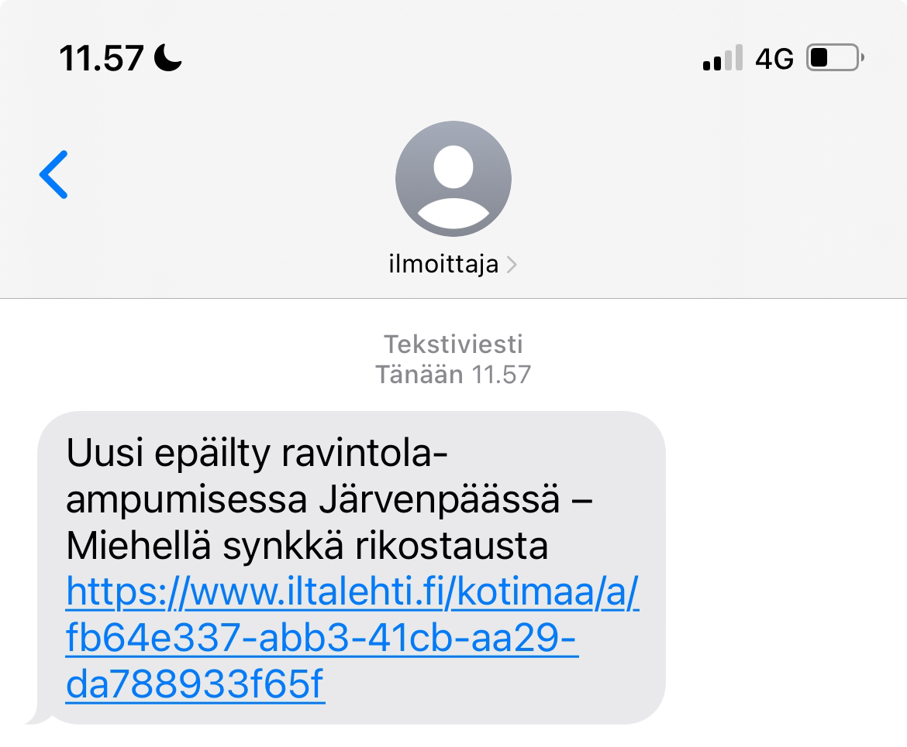

# ilmoittelija
Get alerted by Finnish media's news posts via SMS.
  

# Installation
Clone the repository

    git clone https://github.com/yourusername/your-repo-name.git
    cd your-repo-name

### Install the dependencies:

    npm install

# Configuration

Create a .env file in the root directory of your project.

Add your 46elks API credentials and other configuration settings to the .env file:

    API_CREDENTIALS=your_46elks_api_username:your_46elks_api_password

# Usage

Run the application:

    node index.js
    sh

